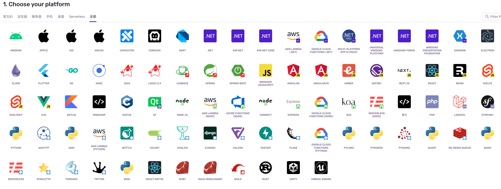
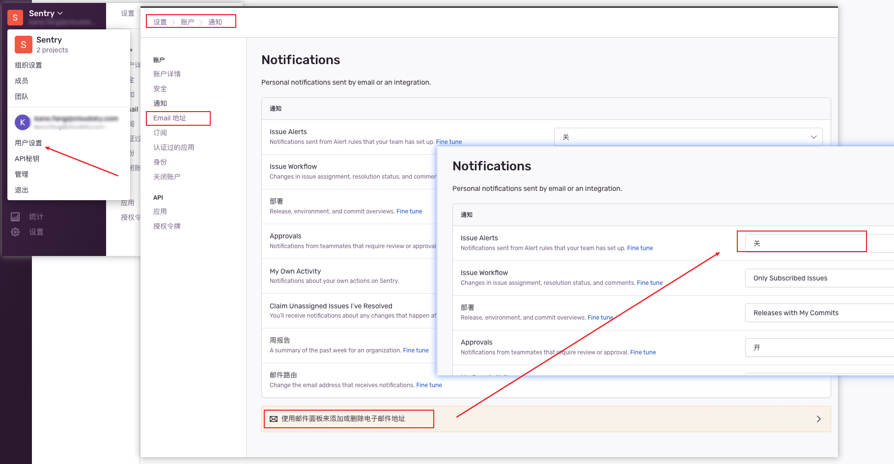

## sentry

sentry 官网：[https://sentry.io/welcome/](https://sentry.io/welcome/)

sentry 是一个实时事件日志记录和聚合平台。它专门用于监视错误和提错误的告警通知。 

## 安装 

安装方式，官网有详细的安装说明在这里[https://develop.sentry.dev/self-hosted/](https://develop.sentry.dev/self-hosted/)

机器要求：

```sh
4 CPU Cores
16 GB RAM + 16 GB swap
20 GB Free Disk Space
```
安装脚本：

```sh 
VERSION=$(curl -Ls -o /dev/null -w %{url_effective} https://github.com/getsentry/self-hosted/releases/latest)
VERSION=${VERSION##*/}
git clone https://github.com/getsentry/self-hosted.git
cd self-hosted
git checkout ${VERSION}
./install.sh
# After installation, run the following to start Sentry:
docker compose up --wait
```
按这个脚本的安装，我并没有安装成功，报错了。原因是有一些 docker image 没有下载下来。报了如下错误：

```sh
Setting up / migrating database ...
 smtp Pulling 
 smtp Error Get "https://registry-1.docker.io/v2/": net/http: request canceled while waiting for connection (Client.Timeout exceeded while awaiting headers)
Error response from daemon: Get "https://registry-1.docker.io/v2/": net/http: request canceled while waiting for connection (Client.Timeout exceeded while awaiting headers)
Error in install/set-up-and-migrate-database.sh:12.
'$dcr web upgrade' exited with status 18
-> ./install.sh:main:34
--> install/set-up-and-migrate-database.sh:source:12

```

遇到了两个，分别是：

- tianon/exim4:latest 
- maxmindinc/geoipupdate:v4.7.1

最后没有办法，我手动的导入了这两个 image 到docker 中。

从其他地方导出了这两个包：

```sh 
docker save -o tianon-exim4.tar tianon/exim4:latest
docker save -o geoipupdate-v4.7.1.tar maxmindinc/geoipupdate:v4.7.1

```
然后，要安装的环境中导入这两个包：

```sh 
docker load -i tianon-exim4.tar
docker load -i geoipupdate-v4.7.1.tar
```

然后，在包的目录下执行 ``./install.sh 就可以了。这个东西一共要安装 32个 docker image，太多了。更多的说明，还是要参考官网的安装说明。

最后 整体的包文件在这里。 

链接: https://pan.baidu.com/s/1T_FSOaIa4sRcp71RqqvqCg?pwd=24du 提取码: 24du 

## sentry 支持的客户端

sentry 支持的客户端还是很多的，这里列出来了：[https://sentry.io/platforms/](https://sentry.io/platforms/)

除了前端的， 也有后端的语言，所以，sentry 不能单单的叫前端监控。



## 去掉邮件通知

测试的项目一下把我邮箱给占满了，所以，还是暂时去掉




##  一些资料

1、[https://zhuanlan.zhihu.com/p/210765546](https://zhuanlan.zhihu.com/p/210765546)


